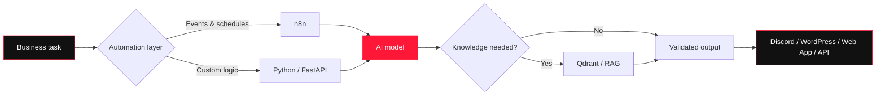

<div align="center">


<a href="https://git.io/typing-svg">
  
</a>

<p>
  <a href="#-what-i-build"></a>
  <a href="#-featured-systems"></a>
  <a href="#-automation-lab"></a>
  <a href="#-connect"></a>
</p>


</div>

## `> whoami`

I'm **Ammar Bin Yasir**, an **AI Automation Engineer** who builds AI agents, n8n workflows, RAG knowledge systems, and API-driven automations.

I use full-stack technologies when an AI system needs a secure interface, backend, database, or deployment—but the goal is always the same: connect AI to a real process and make the result dependable.

```text
Understand the process → Design the workflow → Connect the tools → Validate the output
```

```python
ammar = {
    "role": "AI Automation Engineer",
    "building": ["AI agents", "n8n workflows", "RAG systems"],
    "integrating": ["LLMs", "APIs", "vector databases", "business tools"],
    "principle": "Useful AI must be grounded, testable, and connected to real work."
}
```

## 🤖 What I Build

<table>
<tr>
<td width="33%" valign="top">

### AI Agents

- Research assistants
- Task-focused agents
- Tool and API integration
- Structured AI outputs
- Evidence-grounded responses

</td>
<td width="33%" valign="top">

### n8n Automation

- Multi-step AI workflows
- Scheduled research pipelines
- Discord and WordPress automation
- Webhooks and REST APIs
- Content-processing systems

</td>
<td width="33%" valign="top">

### RAG Systems

- Private knowledge bases
- Document ingestion
- Qdrant vector search
- Scoped retrieval
- Source-grounded answers

</td>
</tr>
</table>

## 🧭 How My Systems Work



## ✨ Featured Systems

<details open>
<summary><strong>📚 Grounded Knowledge Workspace — private RAG with controlled sources</strong></summary>
<br>

A document-backed AI workspace where users upload company knowledge, create assistants, and control exactly which documents each assistant may search.

**What makes it useful:** tenant-aware retrieval, assistant-specific document selection, duplicate detection, grounded answers, and coordinated document deletion.

**Stack:** `n8n` `Qdrant` `Gemini` `Supabase` `Next.js` `TypeScript`

[Explore the repository →](https://github.com/AmmarBinYasir489/grounded-knowledge-workspace)

</details>

<details open>
<summary><strong>🔎 AI Research Assistant — evidence before answers</strong></summary>
<br>

A research agent that searches current sources, evaluates evidence, and produces confidence-aware summaries with citations.

**What makes it useful:** research and response generation are separated, sources are ranked, and answers show supporting evidence instead of hiding it.

**Stack:** `Python` `FastAPI` `Ollama` `Gemini` `Search APIs`

[Explore the repository →](https://github.com/AmmarBinYasir489/ai-research-assistant)

</details>

<details>
<summary><strong>🧭 CodeRecall — grounded memory for software projects</strong></summary>
<br>

An evidence-backed developer memory system that understands Git repositories, helps recover unfinished work, and answers codebase questions with file and line references.

**Stack:** `Python` `Git` `Grounded AI` `Developer Tools`

[Explore the repository →](https://github.com/AmmarBinYasir489/coderecall)

</details>

<details>
<summary><strong>💳 Expense AI — natural language to structured financial data</strong></summary>
<br>

An AI-powered expense system that converts everyday messages into validated transactions and supports budgets, loans, analytics, and financial Q&A grounded in saved records.

**Stack:** `Gemini` `Next.js` `TypeScript` `Supabase` `PostgreSQL` `Zod`

[Explore the repository →](https://github.com/AmmarBinYasir489/expense-ai)

</details>

<details>
<summary><strong>🥗 Nourish — multimodal meal analysis</strong></summary>
<br>

An AI-assisted nutrition system that analyzes meal photos, returns validated nutrition estimates, and turns confirmed meals into reusable personal templates.

**Stack:** `Gemini Vision` `Next.js` `Supabase` `PostgreSQL` `Zod`

[Explore the repository →](https://github.com/AmmarBinYasir489/calories-counter)

</details>

## ⚡ Automation Lab

These workflows focus on reducing repetitive research and content operations.

<details>
<summary><strong>📰 AI News Research → Discord</strong></summary>
<br>

An n8n workflow that collects recent AI news, processes and summarizes the findings, then delivers a structured update to Discord.

`Scheduled trigger` → `Research` → `Filter` → `AI summary` → `Discord`

</details>

<details>
<summary><strong>🎬 YouTube → WordPress Article + Featured Image</strong></summary>
<br>

An n8n content workflow that accepts a YouTube link, processes the video's content, generates a structured article and featured image, and sends the result to WordPress.

`YouTube URL` → `Content extraction` → `Article generation` → `Featured image` → `WordPress`

</details>

<details>
<summary><strong>📖 Documents → Qdrant Knowledge Base</strong></summary>
<br>

An n8n-powered RAG pipeline for ingesting documents, creating embeddings, storing searchable chunks in Qdrant, and retrieving scoped context for grounded answers.

`Document` → `Extract` → `Chunk` → `Embed` → `Qdrant` → `Grounded answer`

</details>

> Workflow exports and screenshots should be published only after credentials, webhook URLs, account IDs, and private data have been removed.

## 🧰 Core Toolkit

<div align="center">

### AI, Agents & Automation


### APIs, Data & Delivery


</div>

## 🎯 Current Focus

- Building task-focused AI agents and research assistants
- Designing reliable n8n and API-driven automations
- Creating private RAG systems with controlled retrieval
- Connecting multimodal AI to useful applications
- Improving validation, security, and maintainability in AI workflows

## 🤝 Connect

I'm interested in **AI agents, workflow automation, RAG systems, and practical AI integrations**.

If you are working on a process that involves repetitive research, documents, content, or disconnected tools, I would be happy to explore how AI and automation could improve it.

<div align="center">

[](https://github.com/AmmarBinYasir489)
[](https://github.com/AmmarBinYasir489?tab=repositories)

<br>

<sub>Build the workflow. Ground the intelligence. Validate the result.</sub>


</div>
