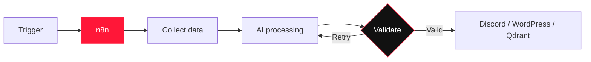

<div align="center">


<br>

<a href="#about"></a>
<a href="#featured-work"></a>
<a href="#automation-lab"></a>
<a href="#toolkit"></a>

<br><br>

<a href="https://git.io/typing-svg">
  
</a>

</div>

---

<a id="about"></a>

## `01. ABOUT`

<table>
<tr>
<td width="58%" valign="middle">

### Hi, I'm Ammar 👋

I'm an **AI Automation Engineer** building AI agents, n8n workflows, RAG knowledge systems, and API-driven automations.

I focus on the part that turns an AI demo into a useful system: connecting models to data, tools, decisions, and real outputs.

```yaml
role: AI Automation Engineer
focus:
  - AI agents
  - n8n automation
  - RAG systems
  - API integration
currently_building: reliable, grounded AI workflows
```

</td>
<td width="42%" align="center" valign="middle">


</td>
</tr>
</table>

> **My rule:** AI should not only generate text. It should understand context, use the right tools, produce validated output, and move work forward.

---

## `02. WHAT I BUILD`

<table>
<tr>
<td width="33%" valign="top">

### 🤖 AI Agents

Research assistants, task-focused agents, tool use, structured outputs, and evidence-grounded responses.

</td>
<td width="33%" valign="top">

### ⚡ Automation

n8n workflows, scheduled pipelines, webhooks, REST APIs, Discord, WordPress, and third-party integrations.

</td>
<td width="33%" valign="top">

### 📚 RAG

Document ingestion, embeddings, Qdrant vector search, scoped retrieval, and private knowledge assistants.

</td>
</tr>
</table>

```text
TRIGGER  →  ORCHESTRATE  →  REASON  →  RETRIEVE  →  VALIDATE  →  ACT
 event         n8n          LLM         RAG          rules       output
```

---

<a id="featured-work"></a>

## `03. FEATURED WORK`

<details open>
<summary><strong>📚 Grounded Knowledge Workspace</strong> — private, scoped RAG</summary>
<br>

Upload company documents, create assistants, and control exactly which sources each assistant may search. Retrieval is constrained by tenant and selected document IDs.

`n8n` `Qdrant` `Gemini` `Supabase` `RAG` `TypeScript`

[Repository →](https://github.com/AmmarBinYasir489/grounded-knowledge-workspace)

</details>

<details open>
<summary><strong>🔎 AI Research Assistant</strong> — evidence before answers</summary>
<br>

A research agent that discovers current sources, evaluates evidence, and produces cited, confidence-aware summaries.

`Python` `FastAPI` `Ollama` `Gemini` `Search APIs`

[Repository →](https://github.com/AmmarBinYasir489/ai-research-assistant)

</details>

<details>
<summary><strong>🧭 CodeRecall</strong> — grounded developer memory</summary>
<br>

Understands Git repositories, helps recover unfinished work, and answers codebase questions using file and line evidence.

`Python` `Git` `Grounded AI` `Developer Tools`

[Repository →](https://github.com/AmmarBinYasir489/coderecall)

</details>

<details>
<summary><strong>💳 Expense AI</strong> — natural language to validated records</summary>
<br>

Converts everyday financial messages into structured transactions and supports budgets, loans, analytics, and Q&A grounded in saved data.

`Gemini` `Next.js` `Supabase` `PostgreSQL` `Zod`

[Repository →](https://github.com/AmmarBinYasir489/expense-ai)

</details>

<details>
<summary><strong>🥗 Nourish</strong> — multimodal nutrition analysis</summary>
<br>

Analyzes meal photos, returns validated nutrition estimates, and turns confirmed meals into reusable templates.

`Gemini Vision` `Next.js` `Supabase` `PostgreSQL` `Zod`

[Repository →](https://github.com/AmmarBinYasir489/calories-counter)

</details>

<div align="right">

[View all repositories →](https://github.com/AmmarBinYasir489?tab=repositories)

</div>

---

<a id="automation-lab"></a>

## `04. AUTOMATION LAB`

<table>
<tr>
<td width="33%" valign="top">

### 📰 News → Discord

Researches recent AI news, filters and summarizes the findings, then delivers a structured Discord update.

`Schedule` `Research` `LLM` `Discord`

</td>
<td width="33%" valign="top">

### 🎬 YouTube → WordPress

Transforms a YouTube link into a structured WordPress article with a generated featured image.

`YouTube` `AI Content` `Image` `WordPress`

</td>
<td width="33%" valign="top">

### 📖 Docs → Qdrant

Extracts and chunks documents, creates embeddings, and stores scoped vectors for grounded retrieval.

`Documents` `Embeddings` `Qdrant` `RAG`

</td>
</tr>
</table>

<details>
<summary><strong>Open the automation pipeline</strong></summary>
<br>



</details>

---

<a id="toolkit"></a>

## `05. TOOLKIT`

<div align="center">

### Intelligence & Orchestration


### Engineering


</div>

---

## `06. ACTIVITY`

<div align="center">


</div>

---

## `07. NOW`

- Building task-focused agents that use tools and evidence
- Designing n8n workflows for research and content operations
- Developing private knowledge systems with controlled retrieval
- Improving validation, security, and maintainability in AI workflows

---

<div align="center">

### Have a repetitive process or disconnected set of tools?

**Let's turn it into an intelligent workflow.**

[](https://github.com/AmmarBinYasir489?tab=repositories)

<br><br>

<sub>Build the workflow · Ground the intelligence · Validate the result</sub>

</div>
